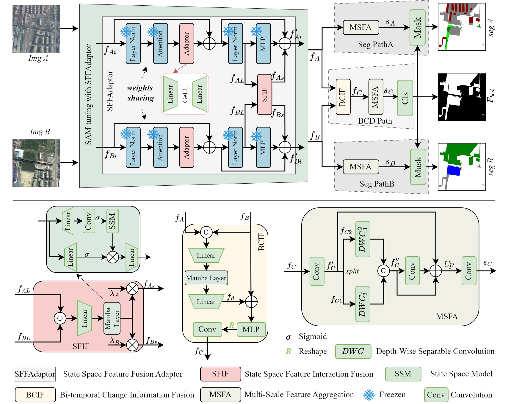

## An SAM Fine-Tuning Framework with Frequency-Domain Interactive LoRA for Remote Sensing Change Detection

accepted by [TGRS](https://doi.org/10.1109/TGRS.2026.3650952)



the entire project can achieve [AI Studio](https://aistudio.baidu.com/projectdetail/9663554?sUid=285037&shared=1&ts=1761739128098)
You can preview the effects of MLCD and DSCD in the [demo](https://aistudio.baidu.com/application/detail/120039).

### Citation
```
@ARTICLE{11329007,
  author={Huang, Junqing and Ji, Shucheng and Wang, Yapeng and Xia, Min and Yuan, Xiaochen},
  journal={IEEE Transactions on Geoscience and Remote Sensing}, 
  title={An SAM Fine-Tuning Framework With Frequency-Domain Interactive LoRA for Remote Sensing Change Detection}, 
  year={2026},
  volume={64},
  number={},
  pages={1-19},
  keywords={Feature extraction;Frequency-domain analysis;Semantics;Transformers;Remote sensing;Decoding;Context modeling;Land surface;Computer architecture;Fast Fourier transforms;Binary change detection (BCD);frequency-domain interactive LoRA;remote sensing change detection;segment anything model (SAM);semantic change detection (SCD)},
  doi={10.1109/TGRS.2026.3650952}}
```

### Desert Semantic Change Detection (DSCD) Dataset

The DSCD comprises 10,000 high-resolution image pairs, each with dimensions of $256 \times 256$ pixels and spatial resolutions ranging from 0.5 to 2 meters. The images were randomly selected from the northwestern section of the Three-North Shelter Forest Program, a key area undergoing ecological restoration efforts. Corresponding labels were meticulously annotated through expert visual interpretation. The dataset encompasses four distinct change categories: water bodies, woodlands, agricultural lands, and sandy lands. you can get it at [https://www.modelscope.cn/datasets/chuntsing/DSCD](https://www.modelscope.cn/datasets/chuntsing/DSCD)

