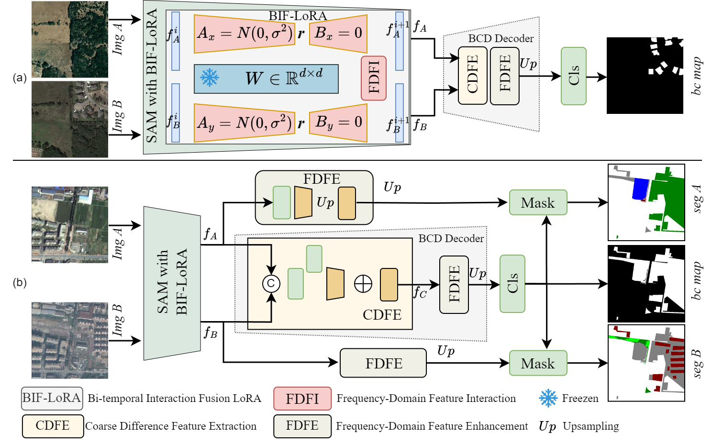

## A SAM Fine-Tuning Framework with Frequency-Domain Interactive LoRA for Remote Sensing Change Detection

the entire project can achieve [AI Studio](https://aistudio.baidu.com/projectdetail/9663554?sUid=285037&shared=1&ts=1761739128098)

### Desert Semantic Change Detection (DSCD) Dataset

The DSCD comprises 10,000 high-resolution image pairs, each with dimensions of $256 \times 256$ pixels and spatial resolutions ranging from 0.5 to 2 meters. The images were randomly selected from the northwestern section of the Three-North Shelter Forest Program, a key area undergoing ecological restoration efforts. Corresponding labels were meticulously annotated through expert visual interpretation. The dataset encompasses four distinct change categories: water bodies, woodlands, agricultural lands, and sandy lands. you can get it at [https://www.modelscope.cn/datasets/chuntsing/DSCD](https://www.modelscope.cn/datasets/chuntsing/DSCD)

